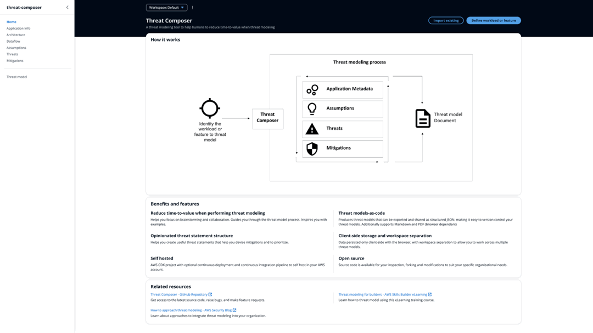
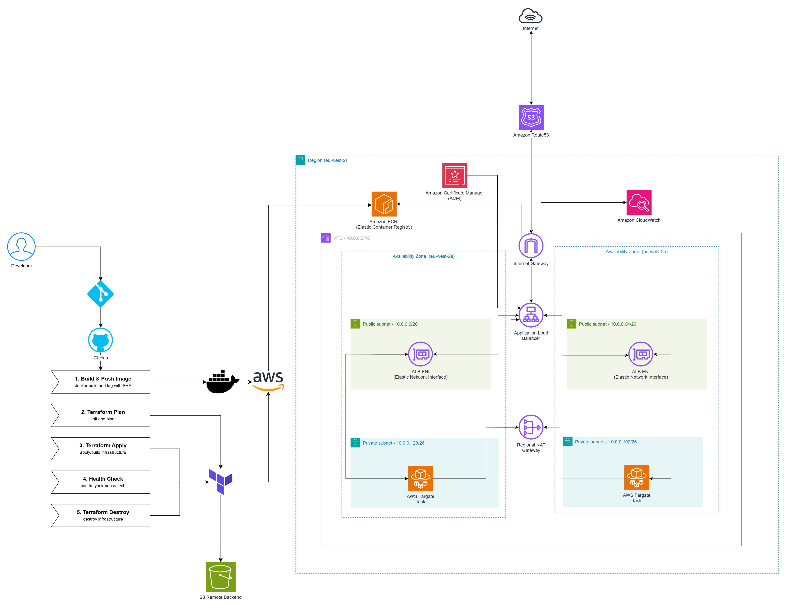
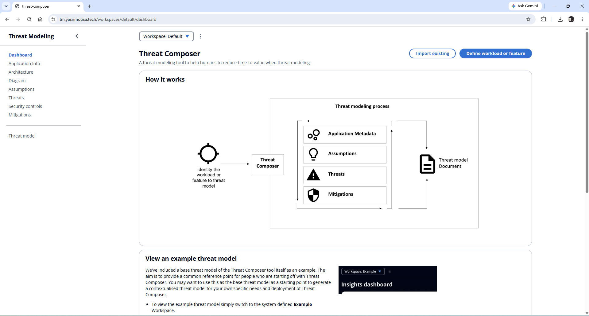
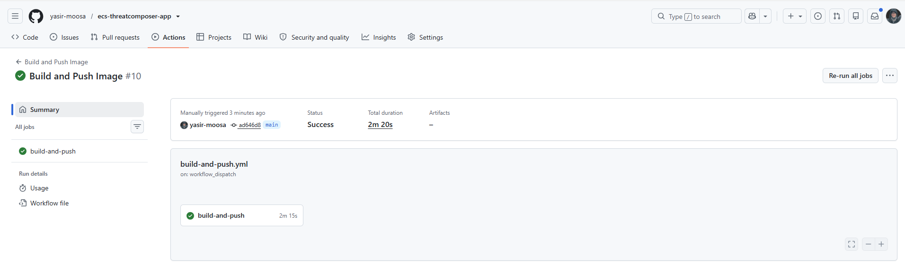
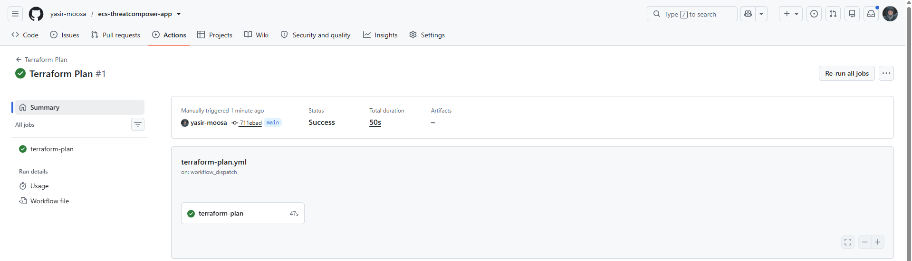
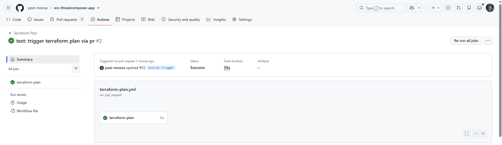
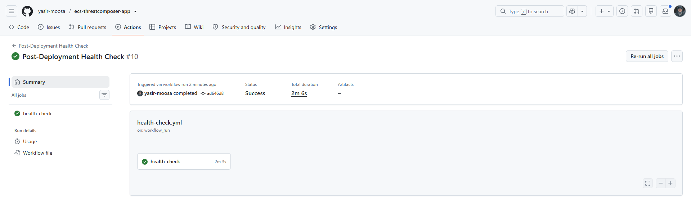
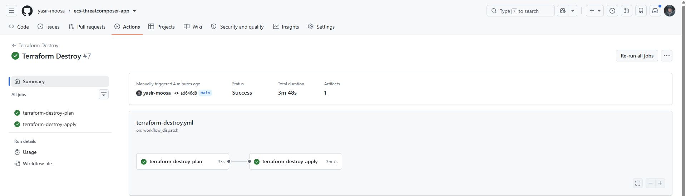
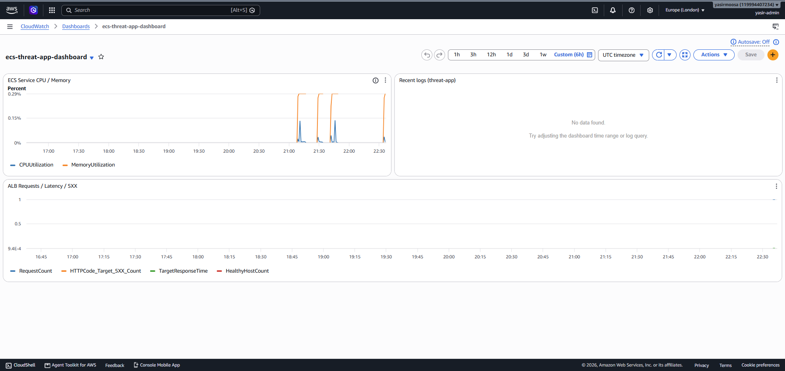

# Threat Composer on ECS Fargate

Threat Composer is an open source app from AWS that helps you build out threat models, you can have a play with it yourself here: [Threat Composer Tool](https://awslabs.github.io/threat-composer/workspaces/default/dashboard). 

I took it and built out a full production-style deployment for it. It's containerised, running on ECS Fargate, sitting behind a load balancer with a real HTTPS domain, all built with Terraform and deployed through a CI/CD pipeline with no long lived AWS keys anywhere.



## Contents

- [Running the app locally](#running-the-app-locally)
- [The deployment](#the-deployment)
- [Architecture](#architecture)
- [Folder layout](#folder-layout)
- [CI/CD](#cicd)
- [Security and code quality scanning](#security-and-code-quality-scanning)
- [Proof of application working](#proof-of-application-working)
- [Successful pipeline runs](#successful-pipeline-runs)
- [CloudWatch dashboard](#cloudwatch-dashboard)
- [Architectural decisions](#architectural-decisions)
- [Future improvements](#future-improvements)
- [License](#license)

## Running the app locally

Clone the repo and run it locally. Use Yarn for a live dev server or Docker to run the exact image that gets deployed to ECS.

**Clone the repo**

Use the following commands to clone the repo:

```bash
git clone https://github.com/yasir-moosa/ecs-threatcomposer-app.git
cd ecs-threatcomposer-app
```

**With Yarn**

Use the following commands to install dependencies and start the dev server:

```bash
cd app
yarn install
yarn start
```

Opens at `http://localhost:3000`.

**With Docker**

Use the following commands to build the Docker image and run it as a container:

```bash
cd ..
docker build -t threat-composer:local .
docker run --rm -p 8080:8080 threat-composer:local
```

Then check it's healthy:

```bash
curl http://localhost:8080/health
# {"status":"ok"}
```

## The deployment

Threat Composer application runs as a Docker container inside ECS Fargate. Traffic comes in through an Application Load Balancer on port 443, gets terminated with a real ACM certificate and gets routed to whichever Fargate task is healthy at the time. There's no server to patch or SSH into, Fargate handles the compute for you.

Everything from the VPC up is created by Terraform. 

## Architecture



- A VPC spanning two Availability Zones with public and private subnets in each
- A regional (multi-AZ) NAT Gateway so the Fargate tasks in the private subnets can pull the image from the ECR and reach the internet without needing one NAT Gateway per AZ
- An Application Load Balancer in the public subnets, listening on 80 and 443
- Port 80 just redirects straight to 443, nothing serves plain HTTP
- ECS Fargate service running the Threat Composer container in the private subnets
- ECR repository storing the built Docker image
- ACM certificate for `tm.yasirmoosa.tech` is validated automatically through a DNS record in Route53
- Route53 hosted zone and A record pointing the subdomain at the load balancer
- S3 bucket holding the Terraform remote state
- A CloudWatch dashboard (`ecs-threat-app-dashboard`) showing ECS CPU/memory, recent application logs and ALB request count/latency/5XX/healthy-host metrics in one place

## Folder layout

```
.
├── app/
├── Dockerfile
├── bootstrap/
│   ├── s3_bootstrap/
│   │   ├── s3_bootstrap.tf
│   │   └── variables.tf
│   └── ecr_bootstrap/
│       ├── ecr_bootstrap.tf
│       └── ecr_variables.tf
│
├── infra/
│   ├── main.tf
│   ├── provider.tf
│   ├── outputs.tf
│   ├── variables.tf
│   ├── .tflint.hcl
│
│   ├── modules/
│   │   ├── vpc/
│   │   │   ├── vpc_main.tf
│   │   │   ├── vpc_variables.tf
│   │   │   └── vpc_output.tf
│   │   ├── sg/
│   │   │   ├── sg_main.tf
│   │   │   ├── sg_variables.tf
│   │   │   └── sg_outputs.tf
│   │   ├── alb/
│   │   │   ├── alb_main.tf
│   │   │   ├── alb_variables.tf
│   │   │   └── alb_output.tf
│   │   ├── ecs/
│   │   │   ├── ecs_main.tf
│   │   │   ├── ecs_variables.tf
│   │   │   └── ecs_outputs.tf
│   │   ├── acm/
│   │   │   ├── acm_main.tf
│   │   │   ├── acm_variables.tf
│   │   │   └── acm_outputs.tf
│   │   └── route53/
│   │       ├── route53_main.tf
│   │       └── route53_variables.tf
│
└── .github/
    └── workflows/
        ├── build-and-push.yml
        ├── terraform-plan.yml
        ├── terraform-deploy.yml
        ├── health-check.yml
        └── terraform-destroy.yml
```

## CI/CD

There are five workflows and only one pair of them is actually chained together:

1. **Build and Push Image** runs automatically on a push that touches `app/` or the Dockerfile (or can be triggered manually). It lints the Dockerfile with **Hadolint** first (report-only for now), builds the image, runs a **Trivy vulnerability scan** against it (fails the job on any CRITICAL or HIGH severity fixable CVE so a vulnerable image never reaches ECR) then tags it with the commit SHA and pushes it to ECR.
2. **Terraform Plan** runs automatically on any pull request that touches `infra/**` (or can be triggered manually). It's read-only, nothing gets applied. It runs `init`, a TFLint pass, a Checkov scan then `terraform plan` and nothing gets applied here. It just gives reviewers a look at what a change to the infra would actually do before it's merged.
3. **Terraform Deploy** is manual only, you trigger it from the Actions tab. It's split into two jobs: `terraform-plan` runs `init`, `plan` and a Checkov scan against the Terraform code, saving the plan as an artifact. `terraform-apply` then requires manual approval (see [Security and code quality scanning](#security-and-code-quality-scanning)) before it downloads that exact plan and applies it. This way what gets applied is guaranteed to be what the plan showed, not a fresh plan that might have drifted and nothing reaches AWS without a deliberate approval click.
4. **Post-Deploy Health Check** runs automatically right after Terraform Deploy finishes successfully (or manually on its own). It waits 2 minutes for the ECS tasks to stabilize then curls the live site with up to 10 retries (30s apart) before failing, so it doesn't falsely fail on a service that's still starting up.
5. **Terraform Destroy** is manual only and requires typing the word "destroy" into a confirmation field before it'll run anything. It follows the same two-job pattern as Deploy. A `terraform-destroy-plan` job saves exactly what will be torn down then `terraform-destroy-apply` requires the same manual approval before it destroys it.

None of this uses long lived AWS access keys. GitHub Actions authenticates to AWS through OIDC (OpenID Connect). AWS trusts GitHub's identity provider directly and issues short lived credentials to a specific IAM role only when the workflow is running from this exact repo. No secrets to rotate or leak.

## Security and code quality scanning

- **Trivy** scans the built Docker image for OS and library vulnerabilities before it's pushed. Only fixable CRITICAL/HIGH findings block the pipeline so unfixable issues don't stall deployments.
- **TFLint** (with the AWS ruleset plugin) lints the Terraform code on every deployment for unused variables, missing provider/version constraints and AWS-specific best practices. Currently set to report-only, not blocking.
- **Checkov** scans the same Terraform code for IaC misconfigurations such as unencrypted resources, overly permissive security groups and missing logging in the same `terraform-plan` job. It's currently set to `soft_fail: true` so findings show up in the job logs but don't actually block a deployment. This is similar as the TFLint for now.
- **Hadolint** lints the `Dockerfile` itself before it's built. It checks things like pinned base image versions, avoiding root where unnecessary and general Dockerfile best practices. Currently report-only similar to Checkov and TFLint.
- **Deployment approval**: `terraform-apply` (in **Terraform Deploy**) and `terraform-destroy-apply` (in **Terraform Destroy**) are gated by a `production` GitHub Environment with required reviewers. Both sit in a "Waiting" state until approved so nothing runs automatically. I'm currently the only reviewer so it's a self-approval gate for now but it still forces a deliberate step before anything reaches AWS.
- **Pinned actions**: Every third-party GitHub Action is pinned to its exact commit SHA and not a mutable tag. Each one has the version noted in the comment after it (e.g. `actions/checkout@11d5960a326750d5838078e36cf38b85af677262 # v4`). Tags like `v4` can be silently repointed to different code, which is how a real 2025 supply-chain attack on `tj-actions/changed-files` leaked secrets across thousands of repos ([you can read more about it here](https://www.wiz.io/blog/github-action-tj-actions-changed-files-supply-chain-attack-cve-2025-30066)). Pinning to the SHA guarantees the pipeline always runs the code that was actually verified.

## Proof of application working

URL used: `tm.yasirmoosa.tech`



## Successful pipeline runs

### Docker Image Publish


### Terraform Plan via Manual Trigger


### Terraform Plan via Pull Request


### Terraform Plan + Apply


### Domain URL Health Check


### Terraform Plan + Destroy


## CloudWatch dashboard



## Architectural decisions

- The ALB has a `create_before_destroy` lifecycle rule on its target group. Without it, changing certain settings forces a replace and Terraform tries to delete the old target group while a listener still points at it which fails.
- The ECS task execution role is created by Terraform rather than assumed to already exist so the whole thing is reproducible in a fresh AWS account.
- The GitHub Actions IAM role currently has broad managed policies attached (EC2, ECS, S3, IAM, Route53, ACM, CloudWatch) rather than a tightly scoped custom policy. For a real production setup this should be narrowed down to only what's actually needed.
- Docker uses a multi-stage build. Node builds the app in one stage, then only the built static files get copied into a slim nginx stage, so build tools and dependencies never make it into the final image. The runner stage also runs `apk upgrade` (briefly as root, then drops back to the unprivileged `nginx` user) so the base Alpine image's OS packages get security patches at build time, and traffic is served by that non-root user rather than root.
- OIDC is used across the pipeline so GitHub Actions gets short-lived AWS credentials scoped to a specific IAM role rather than long-lived access keys stored as secrets.
- The app runs on ECS Fargate rather than something like EKS. For a single container workload, Kubernetes' overhead (control plane, cluster management) isn't justified, Fargate provides serverless compute without needing to manage or patch servers.
- The domain's DNS stays in Route53 rather than a third-party provider which keeps ACM's DNS validation fully automatic since Route53 and ACM are natively integrated, no manual CNAME copying required.
- Terraform is split into separate modules (vpc, sg, alb, ecs, acm, route53) rather than one large file so each piece can be understood and changed independently.
- No AWS credentials are stored as GitHub Secrets at all, OIDC removes that requirement entirely so there's nothing sitting in the repo that could leak.

## Future improvements

- Scope down the single GitHub Actions IAM role into least-privilege, function-specific roles (build, deploy, destroy) instead of one role with broad managed policies attached.
- Move TFLint, Checkov, and Hadolint from report-only to blocking once the current findings are cleaned up.
- Add a second required reviewer for deployment approvals rather than the current self-approval setup.
- Run bootstrapping (the initial S3 backend and ECR repo creation) as its own pipeline, removing the manual first step before the rest of the infrastructure can deploy.
- Add ECS Service Auto Scaling based on CPU/memory (or ALB request count) so the Fargate service can scale horizontally under load rather than running a fixed task count.

## License

Infra, CI/CD and Dockerfile are MIT licensed. Threat Composer is licensed under Apache License 2.0.